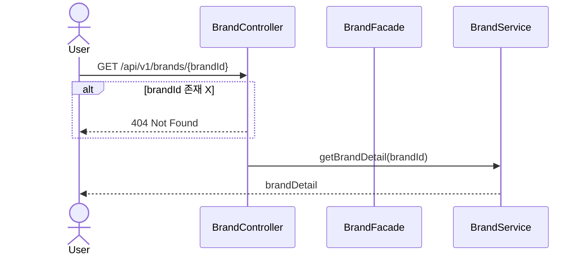
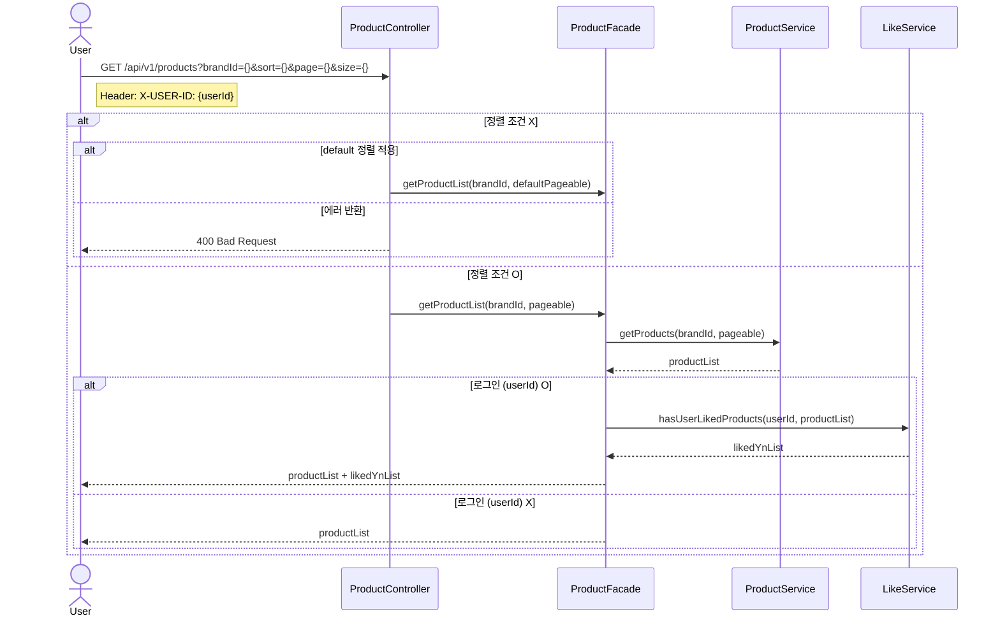
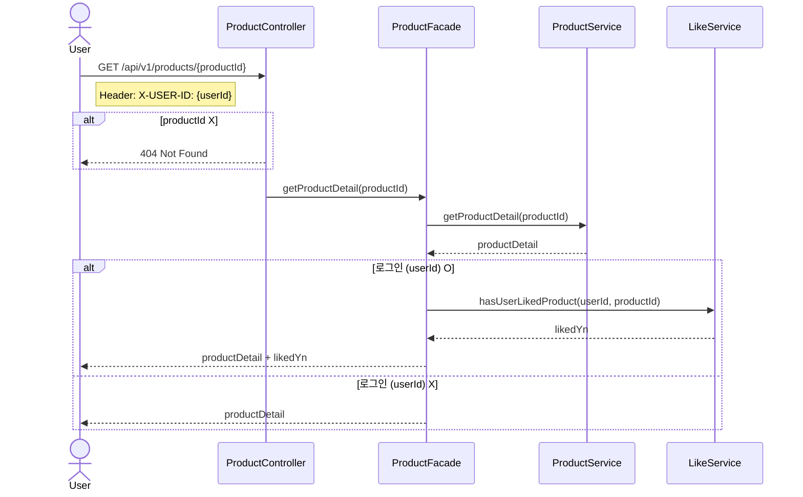
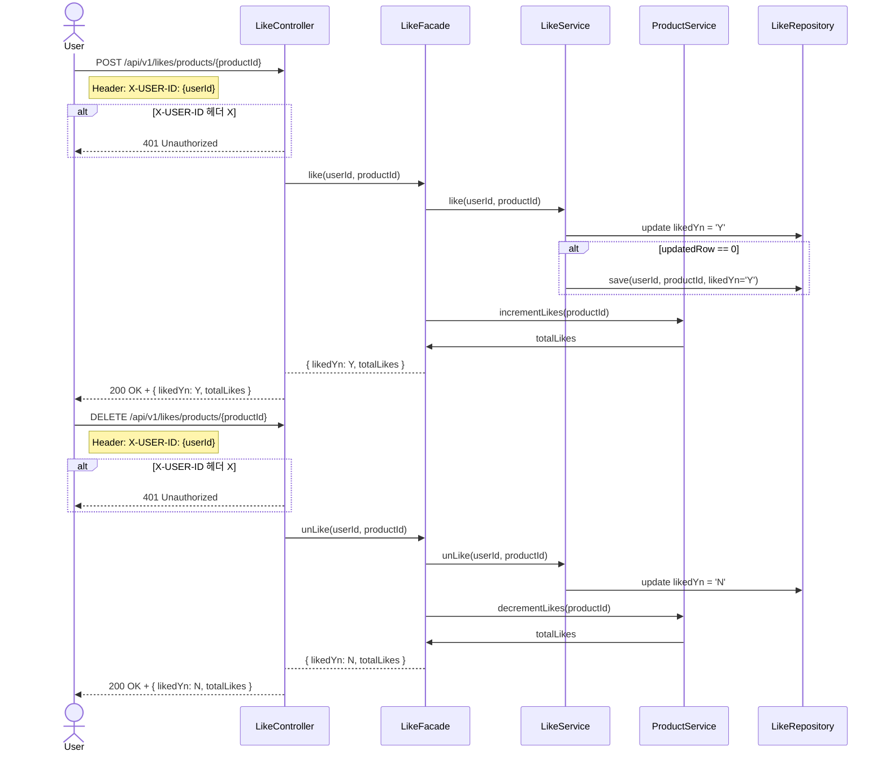
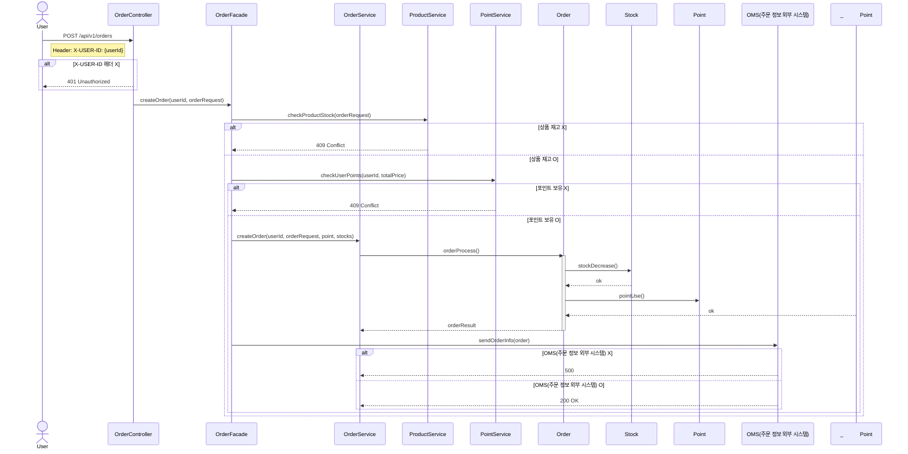
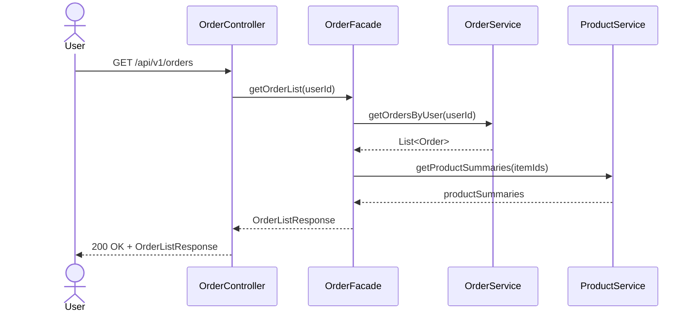
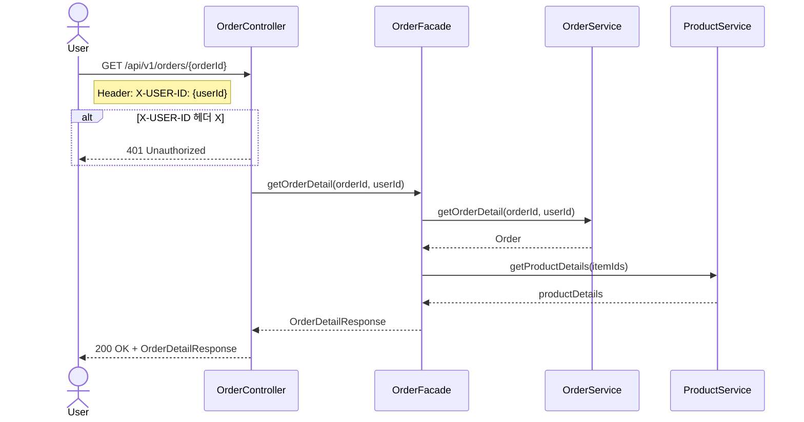

# 시퀀스 다이어그램

### 브랜드 정보 조회

```mermaid
sequenceDiagram
    actor User
    participant BrandController
    participant BrandFacade
    participant BrandService

    User->>BrandController: GET /api/v1/brands/{brandId}
    alt brandId 존재 X
        BrandController-->>User: 404 Not Found
    end
    
    BrandController->>BrandService: getBrandDetail(brandId)
    BrandService-->>User: brandDetail
```

### 상품 목록 조회

```mermaid
sequenceDiagram
    actor User
    participant ProductController
    participant ProductFacade
    participant ProductService
    participant LikeService

    %% /api/v1/products?brandId=1&sort=createdAt,desc&sort=price,asc&sort=likes,desc&page=0&size=20
    User->>ProductController: GET /api/v1/products?brandId={}&sort={}&page={}&size={}
    note right of User: Header: X-USER-ID: {userId}

    alt 정렬 조건 X
        alt default 정렬 적용
            ProductController->>ProductFacade: getProductList(brandId, defaultPageable)
        else 에러 반환
            ProductController-->>User: 400 Bad Request
        end
    else 정렬 조건 O
        ProductController->>ProductFacade: getProductList(brandId, pageable)
        ProductFacade->>ProductService: getProducts(brandId, pageable)
        ProductService-->>ProductFacade: productList

        alt 로그인 (userId) O
            ProductFacade->>LikeService: hasUserLikedProducts(userId, productList)
            LikeService-->>ProductFacade: likedYnList
            ProductFacade-->>User: productList + likedYnList
        else 로그인 (userId) X
            ProductFacade-->>User: productList
        end
    end
```

### 상품 상세 조회

```mermaid
sequenceDiagram
    actor User
    participant ProductController
    participant ProductFacade
    participant ProductService
    participant LikeService
        
    User->>ProductController: GET /api/v1/products/{productId}
    note right of User: Header: X-USER-ID: {userId}
    alt productId X
        ProductController-->>User: 404 Not Found
    end
    
    ProductController->>ProductFacade: getProductDetail(productId)
    ProductFacade->>ProductService: getProductDetail(productId)
    ProductService-->>ProductFacade: productDetail

    alt 로그인 (userId) O
        ProductFacade->>LikeService: hasUserLikedProduct(userId, productId)
        LikeService-->>ProductFacade: likedYn
        ProductFacade-->>User: productDetail + likedYn
    else 로그인 (userId) X
        ProductFacade-->>User: productDetail
    end
```

### 좋아요 등록 및 취소

```mermaid
sequenceDiagram
    actor User
    participant LikeController
    participant LikeFacade
    participant LikeService
    participant ProductService
    participant LikeRepository

    %% 좋아요 생성
    User->>LikeController: POST /api/v1/likes/products/{productId}
    note right of User: Header: X-USER-ID: {userId}
    alt X-USER-ID 헤더 X
        LikeController-->>User: 401 Unauthorized
    end

    LikeController->>LikeFacade: like(userId, productId)
    LikeFacade->>LikeService: like(userId, productId)
    LikeService->>LikeRepository: update likedYn = 'Y' 
    alt updatedRow == 0
        LikeService->>LikeRepository: save(userId, productId, likedYn='Y')
    end
    LikeFacade->>ProductService: incrementLikes(productId)
    ProductService->>LikeFacade: totalLikes
    LikeFacade-->LikeController: { likedYn: Y, totalLikes }
    LikeController-->>User: 200 OK + { likedYn: Y, totalLikes }

    %% 좋아요 삭제
    User->>LikeController: DELETE /api/v1/likes/products/{productId}
    note right of User: Header: X-USER-ID: {userId}
    alt X-USER-ID 헤더 X
        LikeController-->>User: 401 Unauthorized
    end

    LikeController->>LikeFacade: unLike(userId, productId)
    LikeFacade->>LikeService: unLike(userId, productId)
    LikeService->>LikeRepository: update likedYn = 'N' 
    LikeFacade->>ProductService: decrementLikes(productId)
    ProductService->>LikeFacade: totalLikes
    LikeFacade-->LikeController: { likedYn: N, totalLikes }
    LikeController-->>User: 200 OK + { likedYn: N, totalLikes }
```

### 주문 요청

```mermaid
sequenceDiagram
    actor User
    participant OrderController
    participant OrderFacade
    participant OrderService
    participant ProductService
    participant PointService
    participant Order
    participant Stock
    participant Point
    participant OMS(주문 정보 외부 시스템)

    User->>OrderController: POST /api/v1/orders
    note right of User: Header: X-USER-ID: {userId}
    alt X-USER-ID 헤더 X
        OrderController-->>User: 401 Unauthorized
    end
    
    OrderController->>OrderFacade: createOrder(userId, orderRequest)

    OrderFacade->>ProductService: checkProductStock(orderRequest)
    alt 상품 재고 X
        ProductService-->>OrderFacade: 409 Conflict
    else 상품 재고 O
        OrderFacade->>PointService: checkUserPoints(userId, totalPrice)
        alt 포인트 보유 X
            PointService-->>OrderFacade: 409 Conflict
        else 포인트 보유 O
            OrderFacade->>OrderService: createOrder(userId, orderRequest, point, stocks)

            OrderService->>Order: orderProcess()

            activate Order
            Order->>Stock: stockDecrease()
            Stock-->>Order: ok
            Order->>Point: pointUse()
    _           Point-->>Order: ok
            Order-->>OrderService: orderResult
            deactivate Order

            OrderFacade->>OMS(주문 정보 외부 시스템): sendOrderInfo(order)
            alt OMS(주문 정보 외부 시스템) X
                OMS(주문 정보 외부 시스템)-->>OrderService: 500
            else OMS(주문 정보 외부 시스템) O
                OMS(주문 정보 외부 시스템)-->>OrderService: 200 OK
            end
        end
    end
```

### 유저 주문 목록 조회

```mermaid
sequenceDiagram
    actor User
    participant OrderController
    participant OrderFacade
    participant OrderService
    participant ProductService

    User->>OrderController: GET /api/v1/orders
    OrderController->>OrderFacade: getOrderList(userId)
    
    OrderFacade->>OrderService: getOrdersByUser(userId)
    OrderService-->>OrderFacade: List<Order>

    OrderFacade->>ProductService: getProductSummaries(itemIds)
    ProductService-->>OrderFacade: productSummaries

    OrderFacade-->>OrderController: OrderListResponse
    OrderController-->>User: 200 OK + OrderListResponse
```

### 단일 주문 상세 조회

```mermaid
sequenceDiagram
    actor User
    participant OrderController
    participant OrderFacade
    participant OrderService
    participant ProductService

    User->>OrderController: GET /api/v1/orders/{orderId}
    note right of User: Header: X-USER-ID: {userId}
    alt X-USER-ID 헤더 X
        OrderController-->>User: 401 Unauthorized
    end
    
    OrderController->>OrderFacade: getOrderDetail(orderId, userId)
    OrderFacade->>OrderService: getOrderDetail(orderId, userId)
    OrderService-->>OrderFacade: Order

    OrderFacade->>ProductService: getProductDetails(itemIds)
    ProductService-->>OrderFacade: productDetails

    OrderFacade-->>OrderController: OrderDetailResponse
    OrderController-->>User: 200 OK + OrderDetailResponse
```