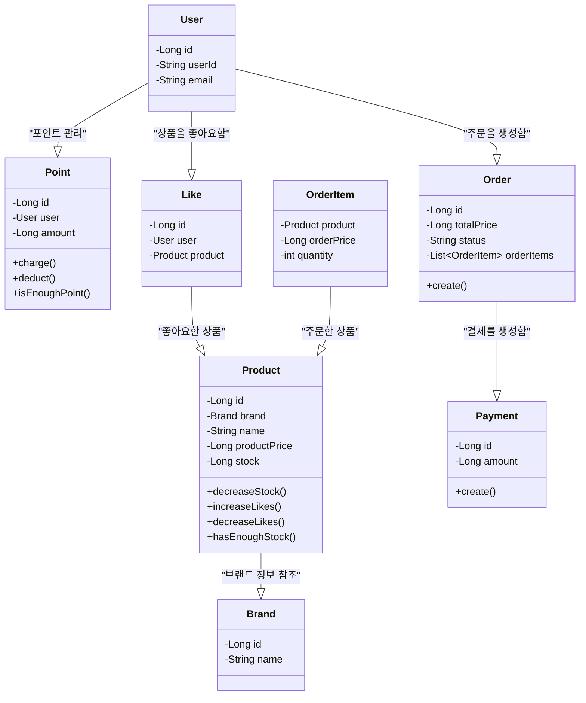

# 클래스 다이어그램

```mermaid
classDiagram
    direction TB
    class User {
    -Long id
    -String userId
    -String email
    }

    class Point {
        -Long id
        -User user
        -Long amount
        +charge()
        +deduct()
        +isEnoughPoint()
    }

    class Brand {
        -Long id
        -String name
    }

    class Product {
        -Long id
        -Brand brand
        -String name
        -Long productPrice
        -Long stock
        +decreaseStock()
        +increaseLikes()
        +decreaseLikes()
        +hasEnoughStock()
    }

    class Like {
        -Long id
        -User user
        -Product product
    }

    class Order {
        -Long id
        -Long totalPrice
        -String status
        -List~OrderItem~ orderItems
        +create()
    }

    class OrderItem {
        -Product product 
        -Long orderPrice
        -int quantity
    }

    class Payment {
        -Long id
        -Long amount
        +create()
    }

    User --|> Point : "포인트 관리"
    User --|> Like : "상품을 좋아요함"
    User --|> Order : "주문을 생성함"
    Order --|> Payment : "결제를 생성함"
    Like --|> Product : "좋아요한 상품"
    OrderItem --|> Product : "주문한 상품"
    Product --|> Brand : "브랜드 정보 참조"
```